<a id="fast-start"></a>
<a id="s"></a>
# TypeCzech


Ditch TypeScript and use TypeCzech runtime type checking instead. 
Live editable [JSFiddles](https://jsfiddle.net/steen_hansen/1Lshcept/?Example-Contents) with visible type checking in the list below.

 - Specify JavaScript [parameter signatures](https://jsfiddle.net/steen_hansen/0xtpLwsc/?00-Readme-Example) and function [return types](https://jsfiddle.net/steen_hansen/wrkvscqg/?05-Verify-Return-Results-by-Value)
 
 - Type check [React](https://jsfiddle.net/steen_hansen/z1yug5nw/?707-React-JSX) components

 - Does not touch [nor affect your code](https://jsfiddle.net/steen_hansen/8kbtyfz1/?204-Extending-Closures-Single)


  - Verify [async/await](https://jsfiddle.net/steen_hansen/q7rckeno/?703-Async-Await) arguments and resolved values

 - Toggle TypeCzech [on or off](https://jsfiddle.net/steen_hansen/f19s52xr/?36-Start-and-Stop) programatically
 
 - Console.log type errors or [throw exceptions](https://jsfiddle.net/steen_hansen/ep3snb8z/?35-Throw-or-Log)
 
 - Catch [empty parameters](https://jsfiddle.net/steen_hansen/x8h6dvj5/?19-Lone-Empty-Param-and-Result) like null, NaN, or an empty array
 
 - Object [interfaces](https://jsfiddle.net/steen_hansen/063wLqfs/?18-Class-Type-Checks) for expected methods and properties

 - Type check [monads](https://jsfiddle.net/steen_hansen/zmd1v27x/?708-Monad-Type-Checking)
<br><br>
 - [npm i type-czech](https://www.npmjs.com/package/type-czech) package with require for Node.js and import for React

  - No compiling, a [single dependency free file ](https://cdn.jsdelivr.net/gh/steenhansen/type-czech@latest/web-resources/TypeCzech.js)

## Shortest Possible Live Example

The [shortest easiest possible example](https://jsfiddle.net/steen_hansen/7c2q54v0/?000-Shortest-Possible-Example) on a live editable JSFiddle.

```
    type_czech = TypeCzech('LOG-ERRORS')                  // type checking code
                
    function BEFORE_addXY(x, y) {                                            
        return type_czech.checkParam_type([x, y], ['number', 'number'])      
    }                                                                        
    addXY = type_czech.linkUp(addXY, BEFORE_addXY)                           
                                                                             
function addXY(x, y) { return x + y }                     // your code

console.log(" 5 + 5     = ", addXY(5, 5))
linesConsole(2)
console.log(" 6 + 'six' = ", addXY(6, 'six'))             // type error
linesConsole(1)
console.log(" 7 + 7     = ", addXY(7, 7))
```


## Base Example


The motivation is to verify function parameters before execution,
and function results after completion with PRE_yourRoutine() and POST_yourRoutine() functions. The example below will not log any type errors in Node.js nor the browser as there are no type errors.

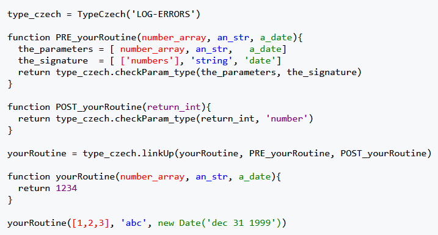

[Run this live on an editable JSFiddle](https://jsfiddle.net/steen_hansen/efLgk3h4/?700-Simple-Example)


## React Node.js SSR Barebones Example

This example is [live on Render.com ](https://type-czech-canonical.onrender.com/) as a slow to start, free hosted site that takes 30-180 seconds to start. View the browser console for type errors as below. The [barebones source](https://github.com/steenhansen/type-czech-canonical#fast-start) needs three commands to start.

  - npm install
  - npm run dev
  - http://localhost:3000/

### Program started with "npm run dev"
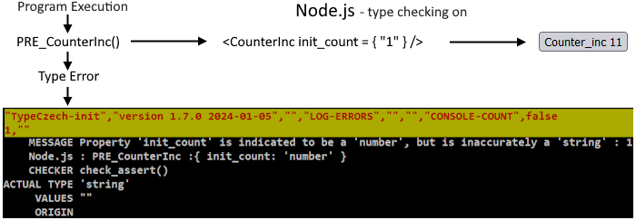

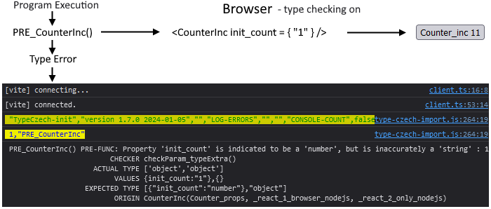

### Program started with "npm run prod"

When the program is launched in production mode, all type checking stops. The incorrect string type is no longer caught.

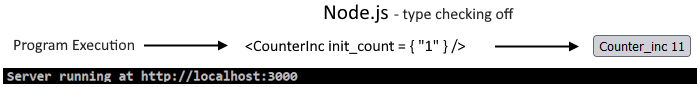

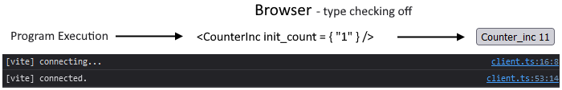


A live editable JSFiddle [707 - React JSX example](https://jsfiddle.net/steen_hansen/z1yug5nw/?707-React-JSX.html) shows how to type check the parameters of a React list component, as well as the properties of the structure returned. 
     


## Node.js Async/Await Example

The live [Run Time Type Checking Square Root Finder](https://type-czech-always-on.onrender.com/), 150 seconds to start on free hosting, verifies that
live aysnc server calls have correct number types. The types checked for are 'Roman Numerals', 'Word Numbers',
'Floats', and 'Integers'. Run locally with the Square Root Finder [source](https://github.com/steenhansen/type-czech-always-on).

The server responds with the square root of XVI is in fact IV. 

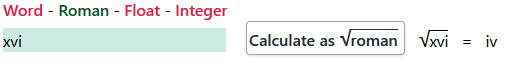
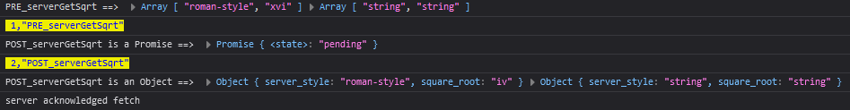

<br>

Here we see an error when we try to calculate the square root of 16 as
a roman number on the server. Locally we get the "'16' is not a valid roman number", and
since the server decides that this is a "400 Bad Request", TypeCzech warns us that the server never returns a valid answer with the "POST_serverGetSqrt E did not return within 3007 milliseconds" error message.

The idea is to simulate a non-returning server crash.

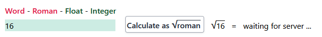
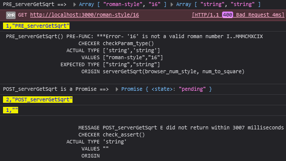

<br>

The server responds with the square root of 16 is 4.

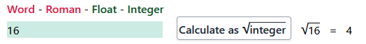
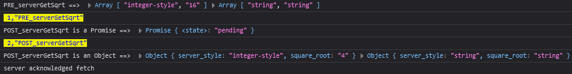


A live editable JSFiddle [703 - Async Await](https://jsfiddle.net/steen_hansen/q7rckeno/?703-Async-Await) shows how to check return types inside an await function.


<a id="live-jsfiddles"></a>


## Live Editable Type-Czech JSFiddle Examples

[Contents](https://jsfiddle.net/steen_hansen/1Lshcept/?Example-Contents) of 74 live editable examples. Best 'Editor layout' is 'Right results'.

|                                                                                                                                    |                                                                                                                        |                                                                                                                                            |                                                                                                                                         |                                                                                                                                            |
|------------------------------------------------------------------------------------------------------------------------------------|------------------------------------------------------------------------------------------------------------------------|--------------------------------------------------------------------------------------------------------------------------------------------|-----------------------------------------------------------------------------------------------------------------------------------------|--------------------------------------------------------------------------------------------------------------------------------------------|
| [00-Readme-Example](https://jsfiddle.net/steen_hansen/0xtpLwsc/?00-Readme-Example)                                                 | [01 - What is TypeCzech?](https://jsfiddle.net/steen_hansen/9u54vsd2/?01-What-is-TypeCzech)                            | [02 - Validate Parameters by Value](https://jsfiddle.net/steen_hansen/6zy89om1/?02-Validate-Parameters-by-Value)                           | [03 - Turn Off TypeCzech by Not Loading Library](https://jsfiddle.net/steen_hansen/m1tce27f/?03-Turn-Off-Library-Not-Loaded)            | [04 - Turn off by Not Loading Checking Functions](https://jsfiddle.net/steen_hansen/nve4d3ah/?04-Turn-Off-No-Check-Functions)              |
| [05 - Verify Return Results by Value](https://jsfiddle.net/steen_hansen/wrkvscqg/?05-Verify-Return-Results-by-Value)               | [06 - Validate Parameters And Results](https://jsfiddle.net/steen_hansen/jxrdom62/?06-Validate-Parameters-and-Results) | [07 - Mutated Function Parameters](https://jsfiddle.net/steen_hansen/abh0jkL1/?07-Mutated-Function-Parameters)                             | [08 - Mutated Recursive Function Parameters](https://jsfiddle.net/steen_hansen/3pv5qwx8/?08-Mutated-Recursive-Function-Parameters)      | [09 - Closure Parameters, Results, and Methods](https://jsfiddle.net/steen_hansen/r8L3mp40/?09-Closure-Parameters-Results-and-Methods)     |
| [10 - Class Parameters, Results, and Methods](https://jsfiddle.net/steen_hansen/Lhwov8y9/?10-Class-Parameters-Results-and-Methods) | [11 - Object Properties](https://jsfiddle.net/steen_hansen/qp29Ljd1/?11-Object-Properties)                             | [12 - Object Interface](https://jsfiddle.net/steen_hansen/og2sk4b9/?12-Object-Interface)                                                     | [13 - Parameter and Result Multi Scalar Types](https://jsfiddle.net/steen_hansen/rh79bLwa/?13-Parameter-and-Results-Multi-Scalar-Types) | [14 - Array and Object Types with Parameter and Results](https://jsfiddle.net/steen_hansen/1ref2ot7/?14-Parameter-and-Results-Multi-Types) |
| [15 - Lone Single Type Parameter Functions](https://jsfiddle.net/steen_hansen/zkhfLw0u/?15-Lone-Single-Type-Parameter-Functions)   | [16 - Arrays with One Type](https://jsfiddle.net/steen_hansen/bsw3yp5c/?16-Arrays-with-One-Type)                       | [17 - Variadic Functions](https://jsfiddle.net/steen_hansen/hrvucjzm/?17-Variadic-Functions.html)                                          | [18 - Class Type Checks](https://jsfiddle.net/steen_hansen/063wLqfs/?18-Class-Type-Checks)                                              | [19 - Lone Empty Parameter and Result](https://jsfiddle.net/steen_hansen/x8h6dvj5/?19-Lone-Empty-Param-and-Result)                         |
| [20 - Multiple Empty Parameters and Results](https://jsfiddle.net/steen_hansen/b7cfsz9y/?20-Multiple-Empty-Params-and-Results)     | [21 - Extra Optional Parameters](https://jsfiddle.net/steen_hansen/Lwn504es/?21-Type-Check-with-Extra-Optional-Params) | [22 - Empty Checks with Extra Optional Parameters](https://jsfiddle.net/steen_hansen/hjxekf63/?22-Empty-Checks-with-Extra-Optional-Params) | [23 - Typed Either Checks](https://jsfiddle.net/steen_hansen/ntrsobk3/?23-Typed-Either-Checks)                                          | [24 - Empty Either Checks](https://jsfiddle.net/steen_hansen/1dL76zws/?24-Empty-Either-Checks)                                             |
| [25 - Default Parameters](https://jsfiddle.net/steen_hansen/8ep7fzu5/?25-Default-Parameters)                                       | [26 - Empty Abbreviations](https://jsfiddle.net/steen_hansen/4a1r03he/?26-Empty-Abbreviations)                         | [27 - Types, Emptiness, and Extra Parameters](https://jsfiddle.net/steen_hansen/tdL7hwgc/?27-Typed-and-Empty-Either-Checks-with-Optionals) | [28 - Accept Null and Undefined Values](https://jsfiddle.net/steen_hansen/zdk1wjgn/?28-Accept-Null-and-Undefined-Values)                | [29 - Class Object Type Checks](https://jsfiddle.net/steen_hansen/27kvuft1/?29-Class-Object-Type-Checks)                                   |
| [30 - HTML Element Type Checks](https://jsfiddle.net/steen_hansen/qkjvpoce/?30-HTML-Type-Checks)                                   | [31 - Extended Class Type Checks](https://jsfiddle.net/steen_hansen/pv7Lt19b/?31-Extended-Class-Type-Checks)           | [32 - Extended Closure Type Checks](https://jsfiddle.net/steen_hansen/1qfjLhsx/?32-Extended-Closure-Type-Checks-check)                     | [33 - Count Parameter Checking Function Calls](https://jsfiddle.net/steen_hansen/gr1bucdp/?33-Count-Checks)                             | [34 - Parameter Check Events](https://jsfiddle.net/steen_hansen/9Lvnhdmq/?34-Parameter-Check-Events)                                       |
| [35 - Throw, Log, or Ignore](https://jsfiddle.net/steen_hansen/ep3snb8z/?35-Throw-or-Log)                                          | [36 - Turn-On, Turn-Off](https://jsfiddle.net/steen_hansen/f19s52xr/?36-Start-and-Stop)                                | [37 - Readme Example Arrow Functions](https://jsfiddle.net/steen_hansen/cwfsubtv/?37-Readme-Example-Arrow-Functions)                       | [38 - Every Check](https://jsfiddle.net/steen_hansen/1umwvht5/?38-Every-Check)                                                          | [39 - Check Asserts](https://jsfiddle.net/steen_hansen/ta7fdnrw/?39-Assert-Checks)                                                         |
|&nbsp;| [40 - Prescribed Use](https://jsfiddle.net/steen_hansen/m1atu7qj/?40-Prescribed-Use)                                               | [41 - Lens Example](https://jsfiddle.net/steen_hansen/fxt8ag56/?41-Lens-Example)                                       | [42 - Extended Objects](https://jsfiddle.net/steen_hansen/rvau7yes/?42-Extended-Objects)                                                   |  [43 -  PHP On Off Extending Classes](https://jsfiddle.net/steen_hansen/dy61bph4/?43-PHP-On-OFF-Extending-Classes)                                                                                                                                                       |
| **Classes**                                                                                                                        | [101 - Extended Classes Inline](https://jsfiddle.net/steen_hansen/cnLrm6ad/?101-Extending-Classes-Inline)              | [102 - Extended Classes Imported](https://jsfiddle.net/steen_hansen/rs4nqL7k/?102-Extending-Classes-Imports)                               | [103 - Extended Classes Production](https://jsfiddle.net/steen_hansen/37mysdz8/?103-Extending-Classes-Production)                       |                                                                                                                                            |
| **Closures**                                                                                                                       | [201 - Closure Modules Inline](https://jsfiddle.net/steen_hansen/6n5pb9eh/?201-Extending-Closures-Inline)              | [202 - Closure Modules Imported](https://jsfiddle.net/steen_hansen/msqcya0f/?202-Extending-Closures-Imports)                               | [203 - Closure Modules Production](https://jsfiddle.net/steen_hansen/ym2vk1tf/?203-Extending-Closures-Production)                       | [204 - Extending Closures Single](https://jsfiddle.net/steen_hansen/8kbtyfz1/?204-Extending-Closures-Single)                               |
| **IIFEs**                                                                                                                          | [301 - IIFE Modules Inline](https://jsfiddle.net/steen_hansen/r26xjw8q/?301-Extending-IIFEs-Inline)                    | [302 - IIFE Modules Imported](https://jsfiddle.net/steen_hansen/ug3f1pqr/?302-Extending-IIFEs-Imports)                                     | [303 - IIFE Modules Production](https://jsfiddle.net/steen_hansen/wrvze5o4/?303-Extending-IIFEs-Production)                             | [304 - Extending IIFEs Single](https://jsfiddle.net/steen_hansen/ktbczhs8/?304-Extending-IIFEs-Single)                                     |
| **Class Free**                                                                                                                     | [401 - ClassFree Constructors Inline](https://jsfiddle.net/steen_hansen/xsyu1Lma/?401-Extending-ClassFree-Inline)      | [402 - ClassFree Constructors Imported](https://jsfiddle.net/steen_hansen/pyqxrs57/?402-Extending-ClassFree-Imports)                       | [403 - ClassFree Constructors Production](https://jsfiddle.net/steen_hansen/57tpy1wm/?403-Extending-ClassFree-Production)               | [404 - Extending ClassFree Single](https://jsfiddle.net/steen_hansen/asjwhbd8/?404-Extending-ClassFree-Single)                             |
| **Prototypes**                                                                                                                     | [501 - Inherited Prototypes Inline](https://jsfiddle.net/steen_hansen/gn38a4k9/?501-Extending-Prototypes-Inline)       | [502 - Inherited Prototypes Imported](https://jsfiddle.net/steen_hansen/retqdosm/?502-Extending-Prototypes-Imports)                        | [503 - Inherited Prototypes Production](https://jsfiddle.net/steen_hansen/2paqh67m/?503-Extending-Prototypes-Production)                | [504 - Extending Prototypes Single](https://jsfiddle.net/steen_hansen/0fabr5g3/?504-Extending-Prototypes-Single)                           |
| **OLOO**                                                                                                                           | [601 - Created OLOO Inline](https://jsfiddle.net/steen_hansen/guw701xv/?601-Created-OLOO-Inline)                       | [602 - Created OLOO Imported](https://jsfiddle.net/steen_hansen/b2qpL9rt/?602-Extending-OLOO-Imports)                                      | [603 - Created OLOO Production](https://jsfiddle.net/steen_hansen/ktezbg7c/?603-Extending-OLOO-Production)                              | [604 - Extending OLOO Single](https://jsfiddle.net/steen_hansen/74Lvbj5x/?604-Extending-OLOO-Single)    
|[700 - Simple-Example](https://jsfiddle.net/steen_hansen/efLgk3h4/?700-Simple-Example)                                                 | [701 - Array of Objects](https://jsfiddle.net/steen_hansen/536du9cb/?701-Array-of-Objects)                            | [702 - DeClassify](https://jsfiddle.net/steen_hansen/jbyor8fm/?702-DeClassify)                           |[703 - Async Await](https://jsfiddle.net/steen_hansen/q7rckeno/?703-Async-Await)                       | [703 - B Async Await - TypeScript Fail](https://jsfiddle.net/steen_hansen/hydvt4jq/?703-B-Async-Await-TypeScript-Fail)                       | 
 | [704 - Ramda Curry](https://jsfiddle.net/steen_hansen/1xLef83o/?704-Ramda-Curry)  | [705 - Sensible Switching](https://jsfiddle.net/steen_hansen/fzh39je0/?705-Sensible-Switching)                                                 | [706 - Elegant On Off](https://jsfiddle.net/steen_hansen/x0pL6jzq/?706-Elegant-On-Off)                            | [707 - React JSX](https://jsfiddle.net/steen_hansen/z1yug5nw/?707-React-JSX)       |[708 - Monad Type Checking](https://jsfiddle.net/steen_hansen/zmd1v27x/?708-Monad-Type-Checking)  |
|[709 - Generators](https://jsfiddle.net/steen_hansen/fytc7a0u/?709-Generators) | [710 - One Check Function](https://jsfiddle.net/steen_hansen/o2sg9act/?710-One-Check-Function) | | | |

## To Install the Package

 [NPM JavaScript library](https://www.npmjs.com/package/type-czech) for Node.js projects.
```
npm i type-czech
```

## Require for Node.js is Supported, as Well as Import for React
```
const { TypeCzech_obj } = require("./node_modules/type-czech/type-czech-require.js");

import TypeCzech_obj from "./node_modules/type-czech/type-czech-import.js";

```


### [Online Examples](./read-mes/online-examples.md)

### [Why Use](./read-mes/why-use.md)

### [Function Expression Error - Uncaught ReferenceError: myFunction is not defined](./read-mes/func-expr-error.md)


### [Lottery Example](./read-mes/lottery-example.md)

### [Assert Pollution](./read-mes/assert-pollution.md)

### [The Idea](./read-mes/the-idea.md)

### [The Recipe](./read-mes/the-recipe.md)

### [Type Signatures](./read-mes/type-signatures.md)

### [Empty Strings, Arrays, and Objects](./read-mes/empty-signatures.md)

### [JSFiddle - 74 Page Live Online Editable Tutorial](https://jsfiddle.net/steen_hansen/1Lshcept/?Example-Contents)

### [Local Filesystem - 74 Page Local Editable Tutorial](./example-snippets/example-contents.html)

### [16 Simple How To Snippets](./read-mes/simple-howto.md)

### [TypeCzech API](./read-mes/api-list.md)

### [Node.js Only Examples](./read-mes/node-only-examples.md)

### [Browser and Node.js Tests](./read-mes/test-suites.md)

### [Recommended Techniques](./read-mes/recommended-techniques.md)

### [Production TypeCzech](./read-mes/production-type-czech.md)

### [FAQ](./read-mes/faq-answers.md)

### [Dependencies](./read-mes/the-dependencies.md)

### [Run Tests](./read-mes/run-tests.md)

### [Compile New Versions](./read-mes/compile-code.md)


### Created by

[Steen Hansen](https://github.com/steenhansen)

&copy; 2024 Steen Hansen
